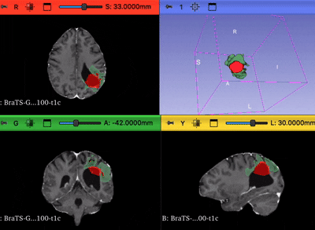

# Multi-task Swin-UNETR with Cross-Task Attention for Brain Tumor MRI


## Overview

A multi-task deep learning architecture for brain glioma MRI (BraTS 2024/2025 GLI)
that couples semantic segmentation of tumor substructures with classification of
their presence via a Cross-Task Attention (CtA) module that feeds the
classifier's features back into the segmentation decoder.

<p align="center">
  
</p>

Compared architectures:

| Architecture | Config | Purpose |
|---|---|---|
| **Swin-UNETR Base** | `model=swin_base` | Segmentation only baseline |
| **Multi-task (standard)** | `model=swin_multitask` | Segmentation and classification, gradients flow freely between both heads |
| **Multi-task (Detach)** | `model=swin_multitask_detach` | Same architecture, gradients between the classification head and CtA module are blocked to prevent the classification loss from destabilizing the shared encoder |

The classification head predicts presence of three tumor substructures
(NETC, SNFH, ET) per patch. **It is not a malignancy grading task.**

## Installation

Requires Python 3.10+.

```bash
git clone git@github.com:nataliachostenko/brats-mt-swin.git
cd brats-mt-swin

conda create -n brats python=3.10 -y
conda activate brats
pip install -e .
```

## Data

The pipeline expects the BraTS 2024/2025 GLI dataset laid out as one directory
per patient each containing the four MRI modalities (`*-t1n.nii.gz`,
`*-t1c.nii.gz`, `*-t2w.nii.gz`, `*-t2f.nii.gz`) and a segmentation mask
(`*-seg.nii.gz`).

Point the pipeline at your local copy either via an environment variable

```bash
export BRATS_DATA_DIR=/path/to/BraTS-GLI/extracted_data
```

or by overriding it on the command line (see below). It defaults to
`./data/BraTS-GLI/extracted_data/` if neither is set.

The dataset is available at Synapse.org after registration.

## Training

Training is driven by [Hydra](https://hydra.cc/); `configs/train.yaml` composes
the data, model, and trainer configs.

```bash
# default: multi-task, standard (no detach)
python train.py

# a specific variant
python train.py model=swin_base
python train.py model=swin_multitask_detach

# override any config value from the CLI
python train.py model=swin_multitask_detach data.batch_size=4 trainer.devices=2
```

`configs/trainer/default.yaml` is set up for multi-GPU DDP (4 devices) and must be adjusted
`trainer.devices` and `trainer.strategy` for a single-GPU or CPU run.
Logging goes to Weights & Biases; set `WANDB_API_KEY` or run `wandb login`
before training or override `logger` to disable it.

## Tests

`pytest` and `flake8` are already installed via `pip install -e .` above.

```bash
pytest tests/
flake8 src/ tests/
```

Covers Cross-Task Attention output shape and non-triviality, multi-task model
forward-pass shapes, the small-component postprocessing filter, and BraTS label
remapping.

## Project structure

```text
├── .github/workflows/      # CI (flake8 + pytest)
├── configs/                # Hydra configs
│   ├── data/                   # dataset / dataloader
│   ├── model/                  # the 4 compared architectures
│   └── trainer/                # DDP / hardware
├── src/
│   ├── models/
│   │   ├── components/         # BaseSwinUNETR, CrossTaskAttention3D,
│   │   │                       # MultiTaskSwinUNETR(Detach)
│   │   └── brats_module.py     # Lightning training/validation loop
│   ├── data/
│   │   └── brats_datamodule.py # MONAI loading and augmentation pipeline
│   └── utils/
│       └── postprocess.py      # small-component removal
├── tests/
└── train.py                # Hydra entrypoint
```

## License

MIT. see [LICENSE](LICENSE).
